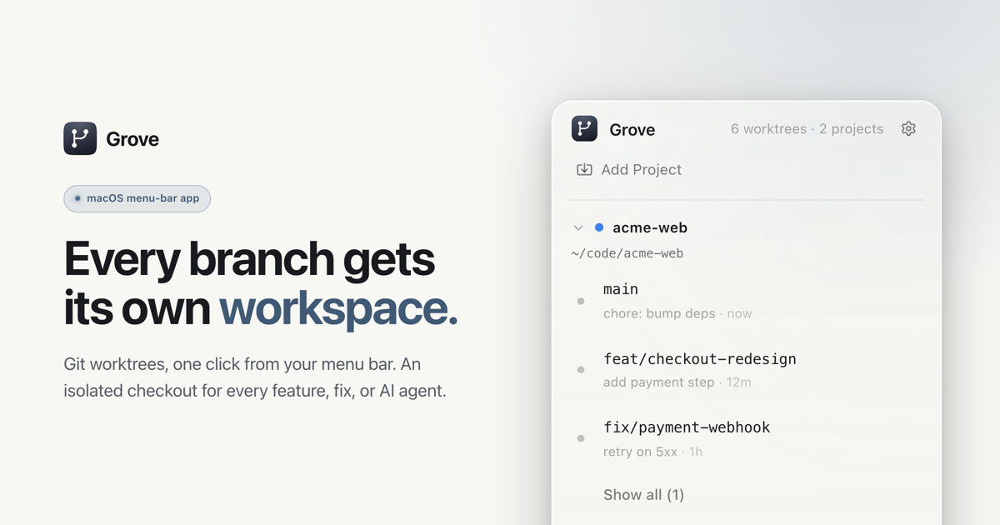

<p align="center">
  
</p>

<h1 align="center">Grove</h1>

<p align="center">Git worktrees from your menu bar.</p>

<p align="center">
  <a href="https://groveworktree.pages.dev">Website</a> ·
  <a href="https://github.com/BarrySong97/grove/releases/latest">Download</a> ·
  <a href="apps/desktop/RELEASING.md">Releasing</a>
</p>



Grove turns git worktrees into one-click workspaces. Spin up an isolated checkout
for every feature, fix, or AI agent — then switch between them from your macOS
menu bar, with setup scripts that just run.

## Install

**Homebrew** (recommended)

```sh
brew install --cask BarrySong97/tap/grove
```

**Direct download** — grab the latest universal macOS DMG from
[Releases](https://github.com/BarrySong97/grove/releases/latest). Apple silicon &
Intel, signed and notarized; in-app updates keep it current.

> Grove is free while in preview.

## Features

- **Worktrees in your menu bar** — managed per project, switch checkouts in one click.
- **Create & archive instantly** — no terminal; setup and cleanup are handled for you.
- **Setup scripts** — define a per-project script that runs automatically on each new worktree.
- **Open anywhere** — jump into your editor, terminal, or Finder (VS Code, Cursor, iTerm, Ghostty, or any app).

## Repository layout

This is a pnpm + [Turborepo](https://turbo.build/) monorepo:

| Path | What |
| --- | --- |
| `apps/desktop` | The Grove macOS app — Tauri (Rust) + React + TypeScript + Vite |
| `apps/web` | Marketing site — Next.js, deployed to Cloudflare Pages |
| `packages/ui` | `@grove/ui` — shared component library used by both |

## Development

**Prerequisites:** Node 22, pnpm 10 (`corepack enable`), and a
[Rust toolchain](https://www.rust-lang.org/tools/install) for the desktop app.

```sh
pnpm install

pnpm dev:desktop   # run the macOS menu-bar app (Tauri)
pnpm dev:web       # run the marketing site (http://localhost:3000)
```

Repo-wide tasks run through Turborepo:

```sh
pnpm build         # build every package
pnpm lint          # lint
pnpm format        # format
pnpm test          # run tests
```

## Releasing

The desktop app ships as a signed, notarized universal DMG on GitHub Releases,
distributed via Homebrew cask with in-app updates. See
[`apps/desktop/RELEASING.md`](apps/desktop/RELEASING.md) for the full workflow.

The marketing site auto-deploys to Cloudflare Pages on every push to `main` that
touches `apps/web/`.
